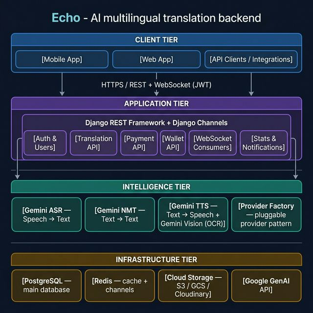
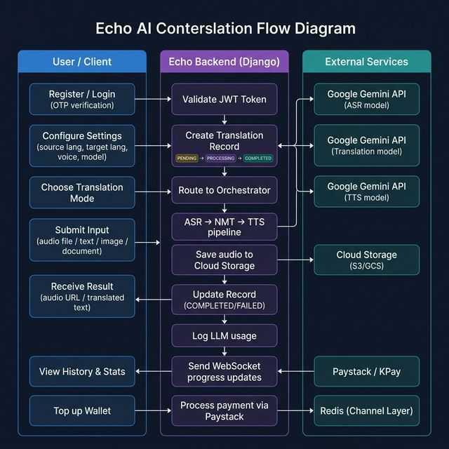
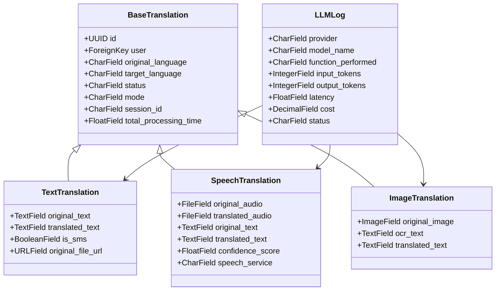
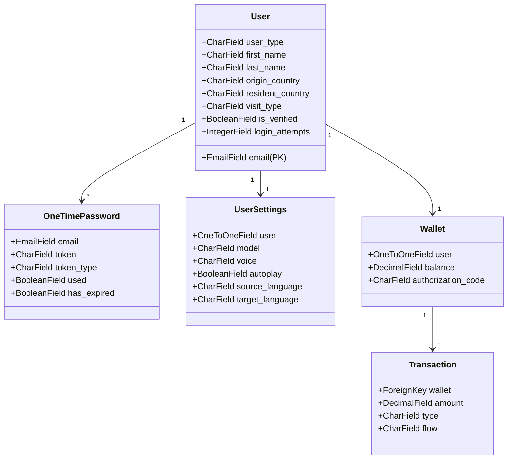

# Echo — Solution Architecture Document

> **Version:** 1.0 · **Date:** March 2026

---

## 1. System Overview

**Echo** is a cloud-native, AI-powered translation backend built with **Django**, **Django REST Framework**, and **Django Channels**. It uses a [Provider Pattern](#4-ai-intelligence-tier) to decouple AI model choices from business logic, and a [TranslationOrchestrator](#orchestration) to choreograph multi-step translation pipelines.

The platform exposes both:
- **REST API** — stateless, JWT-authenticated HTTP endpoints
- **WebSocket API** — real-time progress streaming via Django Channels over Redis

---

## 2. High-Level Architecture



The system is divided into **four horizontal tiers**:

| Tier | Responsibility |
|---|---|
| **Client Tier** | Mobile apps, web apps, REST API clients |
| **Application Tier** | Django REST Framework + Django Channels (all business logic) |
| **Intelligence Tier** | Google Gemini AI providers (ASR, NMT, TTS, Vision) |
| **Infrastructure Tier** | PostgreSQL, Redis, Cloud Storage, Google GenAI API |

---

## 3. Application Flow



### 3.1 Speech-to-Speech Translation Flow

```
Client                       Django Backend                    Google Gemini
  |                               |                                 |
  |-- POST /api/voice/translate ->|                                 |
  |    (JWT + audio file)         |                                 |
  |                               |-- Create SpeechTranslation ---> |
  |                               |    status=PROCESSING            |
  |                               |                                 |
  |                               |-- GeminiASR.transcribe() -----> |
  |                               |<-- { text, language }---------- |
  |                               |                                 |
  |                               |-- GeminiTranslation.translate()->|
  |                               |<-- { translated_text }--------- |
  |                               |                                 |
  |                               |-- GeminiTTS.synthesize() -----> |
  |                               |<-- { raw PCM bytes }----------- |
  |                               |                                 |
  |                               |-- pcm_to_wav() (wrap header)    |
  |                               |-- ContentFile.save() to S3/GCS  |
  |                               |-- Update Record COMPLETED       |
  |                               |-- Log LLM usage                 |
  |                               |                                 |
  |<-- { audio_url, text } -------|                                 |
```

### 3.2 Real-Time WebSocket Flow

```
Client                         Django Channels              TranslationOrchestrator
  |                                   |                              |
  |-- ws://host/ws/voice/ ----------->|                              |
  |    (JWT middleware validates)     |                              |
  |<-- WebSocket accepted ----------- |                              |
  |                                   |                              |
  |-- { type: "voice_process",        |                              |
  |    audio: base64, lang: "sw" } -->|                              |
  |<-- { type: "progress", 20% } -----|                              |
  |                                   |-- sync_to_async() --------->|
  |<-- { type: "progress", 50% } -----|   translate_speech()        |
  |                                   |                              |
  |<-- { type: "complete",            |<-- { audio_url, text } -----|
  |    result: { audio_url... } } ----|                              |
```

---

## 4. AI Intelligence Tier

### 4.1 Provider Pattern

All AI calls are routed through a pluggable **Provider Factory**, making it trivial to swap models or vendors without changing business logic.

```
ProviderFactory
 ├── get_asr_provider()          → GeminiASRProvider
 ├── get_translation_provider()  → GeminiTranslationProvider
 └── get_tts_provider()          → GeminiTTSProvider
```

Each provider implements a base interface:

```
BaseASRProvider         → transcribe(audio, language) → { text, language, confidence }
BaseTranslationProvider → translate(text, src, tgt)   → { translated_text }
BaseTTSProvider         → synthesize(text, lang, voice) → { audio_data (WAV bytes) }
```

### 4.2 Gemini Models

| Purpose | Model | Key Notes |
|---|---|---|
| ASR (Speech → Text) | `gemini-2.0-flash` | Accepts audio/wav bytes or public URL |
| NMT (Text → Text) | `gemini-2.0-flash` | Prompt-based translation |
| TTS (Text → Speech) | `gemini-2.5-flash-preview-tts` | Returns 24kHz 16-bit mono PCM; wrapped in WAV header by `_pcm_to_wav()` |
| OCR + Translate (Image) | `gemini-2.0-flash` (Vision) | Inline image bytes, single-pass OCR + translation |

> **Important:** Gemini TTS returns raw PCM audio — not a WAV file. The `GeminiTTSProvider._pcm_to_wav()` method wraps it in a RIFF WAV container before saving, making it playable by any audio player.

### 4.3 Translation Orchestrator

`TranslationOrchestrator` is the central coordinator that:
1. Creates the DB record (status=`PENDING → PROCESSING`)
2. Calls providers in the correct sequence
3. Stores outputs to cloud storage via `ContentFile`
4. Updates the DB record (status=`COMPLETED | FAILED`)
5. Logs per-provider LLM usage

It exposes four main methods:

| Method | Pipeline |
|---|---|
| `translate_speech()` | ASR → NMT → TTS |
| `speech_to_text()` | ASR (+ optional NMT) |
| `text_to_speech()` | Optional NMT → TTS |
| `translate_text()` | NMT only |
| `translate_image()` | Gemini Vision (OCR + NMT in one call) |

---

## 5. Application Tier — Django Apps

```
echo-v1-backend/
├── core/                 ← Django settings, constants, base models, utilities
├── translation/          ← Core translation domain
│   ├── models.py         ← TextTranslation, SpeechTranslation, ImageTranslation, LLMLog, UserSettings, LanguageSupport
│   ├── orchestrator.py   ← TranslationOrchestrator (multi-step pipelines)
│   ├── serializers.py    ← DRF serializers
│   ├── views/            ← base.py, structured.py, general.py
│   ├── urls/             ← URL routing
│   ├── providers/
│   │   ├── base.py       ← Abstract provider interfaces
│   │   ├── factory.py    ← ProviderFactory
│   │   └── gemini/
│   │       ├── asr.py    ← GeminiASRProvider
│   │       ├── llm.py    ← GeminiTranslationProvider
│   │       └── tts.py    ← GeminiTTSProvider (+ _pcm_to_wav)
│   ├── tasks.py          ← Celery async tasks (long-running jobs)
│   ├── document_processors.py  ← PDF/DOCX translation
│   └── cloud_storage.py  ← S3/GCS/Cloudinary adapters
├── users/                ← Auth, User model (AbstractUser), OTP, roles
├── wallet/               ← Wallet, Transaction (balance management)
├── payment/              ← Paystack, KPay integration + webhook handling
├── realtime/             ← Django Channels consumers (Voice, OCR, Processing)
├── notification/         ← Email/push notifications
├── stats_app/            ← Aggregated usage statistics
├── ocr_app/              ← Standalone OCR app (separate from translation)
└── performance/          ← Performance monitoring utilities
```

---

## 6. Data Models

### Core Translation Models



### User & Finance Models



---

## 7. Real-Time Layer

**Technology:** Django Channels 4 + Redis Channel Layer

```
Client WebSocket
      ↓
ASGI Server (Daphne / Uvicorn)
      ↓
Channel Router
 ├── /ws/voice/      → VoiceConsumer
 ├── /ws/ocr/        → OCRConsumer
 └── /ws/processing/ → ProcessingConsumer
      ↓
Redis Channel Layer (group messaging)
      ↓
TranslationOrchestrator (sync_to_async bridge)
```

Each consumer:
1. Validates user via JWT WebSocket middleware on `connect()`
2. Joins a user-scoped group (`voice_{user_id}`)
3. Receives input, calls the relevant orchestrator method wrapped in `sync_to_async`
4. Streams progress JSON messages back to the client

---

## 8. Payment Architecture

```
User → POST /api/payment/topup/
         ↓
    PaystackIntegration.initialize_transaction()
         ↓
    Returns authorization_url
         ↓
    User completes Paystack checkout
         ↓
    Two paths to verify:
    A) Client calls PATCH /api/payment/verify/<ref>/
    B) Paystack calls POST /api/payment/webhook/ (charge.success)
         ↓
    fulfill_payment() → Wallet.topup(amount) → Transaction.create()
```

**KPay:** Separate webhook endpoint with HMAC signature validation and idempotency via `KPayWebhookEvent` model.

---

## 9. Security Architecture

| Layer | Mechanism |
|---|---|
| API Authentication | JWT (access + refresh tokens via `djangorestframework-simplejwt`) |
| WebSocket Auth | Custom JWT middleware in `realtime/middleware.py` |
| OTP Verification | 6-digit time-limited code; single-use; type-scoped (REGISTRATION / LOGIN / RESET) |
| Account Lockout | `login_attempts` counter + `account_locked_until` timestamp |
| Role-Based Access | `user_type` field: `customer / admin / super_admin` |
| Payment Webhooks | Paystack HMAC signature verification; KPay `X-KPAY-SIGNATURE` header |
| Storage | Media files served from cloud storage (not exposed directly from Django) |

---

## 10. Deployment Stack

```
┌─────────────────────────────────────────────────┐
│  ASGI Server (Daphne or Uvicorn)                │
│  └── Django Application                         │
│       ├── REST API (HTTP/HTTPS)                  │
│       └── WebSocket (ws://)                      │
├─────────────────────────────────────────────────┤
│  PostgreSQL 14+    (primary database)            │
│  Redis 6+          (Django Channels + cache)     │
│  Celery Worker     (async tasks)                 │
├─────────────────────────────────────────────────┤
│  Cloud Storage: AWS S3 / GCS / Cloudinary        │
│  AI: Google GenAI API (Gemini models)            │
│  Payment: Paystack API / KPay API                │
└─────────────────────────────────────────────────┘
```

**Docker:** `Dockerfile` present for containerised deployment. `.dockerignore` configured.

**Environment:** All secrets via `.env` (API keys, DB credentials, payment secrets).

---

## 11. Key Design Decisions

| Decision | Rationale |
|---|---|
| **Provider Factory pattern** | Decouples business logic from AI vendor; swapping models requires changing only the factory |
| **Orchestrator pattern** | Single point of truth for multi-step pipelines; centralises error handling, status updates, and LLM logging |
| **WAV header wrapping in TTS** | Gemini returns raw PCM bytes; `_pcm_to_wav()` makes files playable without re-encoding |
| **Django Channels over polling** | Enables efficient real-time progress streaming without client-side polling overhead |
| **UUID primary keys** | Translation records use UUIDs to prevent ID enumeration and support distributed ID generation |
| **Abstract `BaseTranslation` model** | Shared fields (status, language, user, session_id) DRY-ed across all modality-specific models |
| **`sync_to_async` bridge in consumers** | Orchestrator is synchronous; wrapped to be usable inside async Django Channels consumers without blocking |
