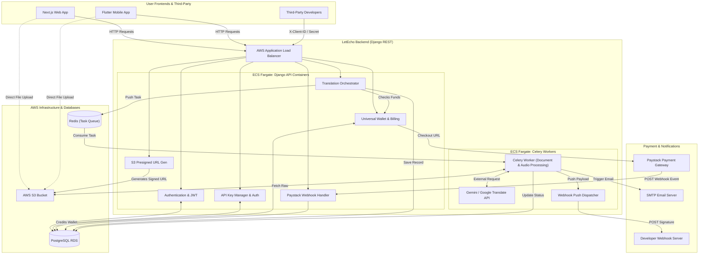

# LetEcho Full Architecture Flow

Here is the complete data flow of the project.

```mermaid
flowchart TD
    %% -------------------
    %% Clients & Frontends
    %% -------------------
    subgraph Clients["User Frontends & Third-Party"]
        Web["Next.js Web App"]
        Mobile["Flutter Mobile App"]
        DevAPI["Third-Party Developers"]
    end

    %% -------------------
    %% External Gateways
    %% -------------------
    subgraph PaymentGateway["Payment & Notifications"]
        Paystack["Paystack Payment Gateway"]
        SMTP["SMTP Email Server"]
        DevServer["Developer Webhook Server"]
    end

    %% -------------------
    %% Backend & API
    %% -------------------
    subgraph LetEchoBackend["LetEcho Backend (Django REST)"]
        ALB["AWS Application Load Balancer"]
        
        subgraph DjangoAPI["ECS Fargate: Django API Containers"]
            Auth["Authentication & JWT"]
            APIGateway["API Key Manager & Auth"]
            Wallet["Universal Wallet & Billing"]
            Presigned["S3 Presigned URL Gen"]
            Orchestrator["Translation Orchestrator"]
            WebhookHandler["Paystack Webhook Handler"]
        end
        
        subgraph AsyncWorkers["ECS Fargate: Celery Workers"]
            CeleryQueue["Celery Worker (Document & Audio Processing)"]
            AIProvider["Gemini / Google Translate API"]
            WebhookDispatcher["Webhook Push Dispatcher"]
        end
    end

    %% -------------------
    %% Infrastructure & Data
    %% -------------------
    subgraph AWSData["AWS Infrastructure & Databases"]
        S3["AWS S3 Bucket"]
        Redis[("Redis (Task Queue)")]
        RDS[("PostgreSQL RDS")]
    end

    %% ===================
    %% Connections & Flow
    %% ===================

    Web -->|HTTP Requests| ALB
    Mobile -->|HTTP Requests| ALB
    DevAPI -->|X-Client-ID / Secret| ALB
    Web -.->|Direct File Upload| S3
    Mobile -.->|Direct File Upload| S3

    ALB --> Auth
    ALB --> APIGateway
    ALB --> Wallet
    ALB --> Presigned
    ALB --> Orchestrator
    ALB --> WebhookHandler

    Auth <--> RDS
    APIGateway <--> RDS
    Wallet <--> RDS
    Orchestrator -->|Checks Funds| Wallet
    Presigned -->|Generates Signed URL| S3

    Wallet -->|Checkout URL| Paystack
    Paystack -->|POST Webhook Event| WebhookHandler
    WebhookHandler -->|Credits Wallet| RDS

    Orchestrator -->|Push Task| Redis
    Orchestrator -->|Save Record| RDS
    Redis -->|Consume Task| CeleryQueue

    CeleryQueue <-->|Fetch Raw| S3
    CeleryQueue <-->|External Request| AIProvider
    CeleryQueue -->|Update Status| RDS
    
    CeleryQueue -->|Trigger Email| SMTP
    CeleryQueue -->|Push Payload| WebhookDispatcher
    WebhookDispatcher -->|POST Signature| DevServer
```
